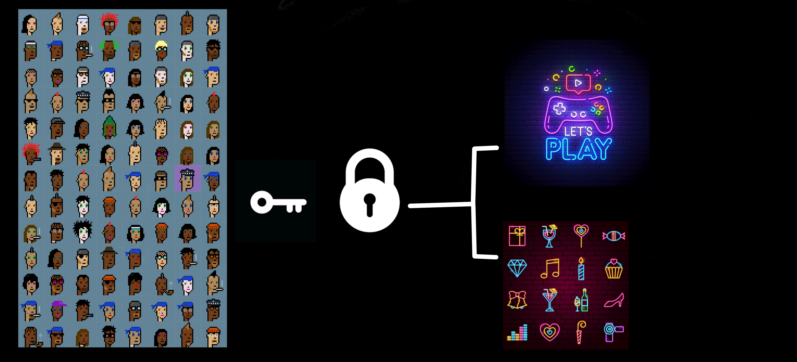
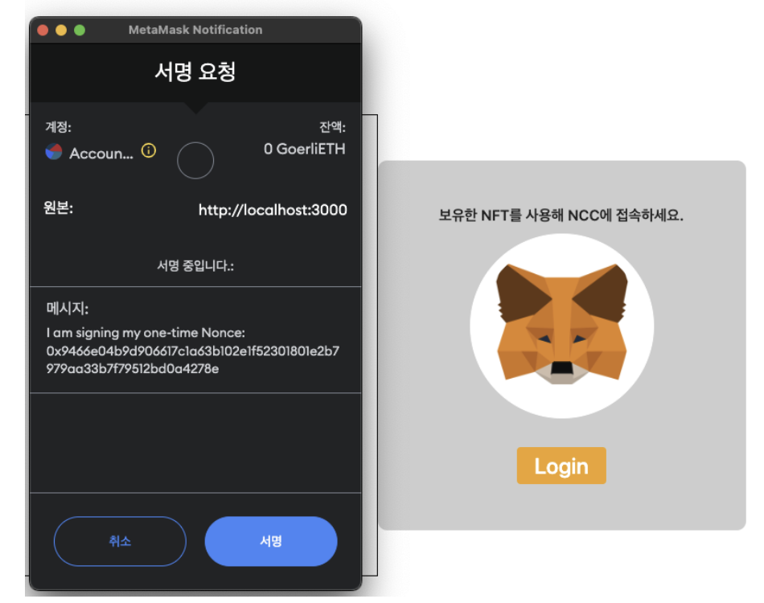
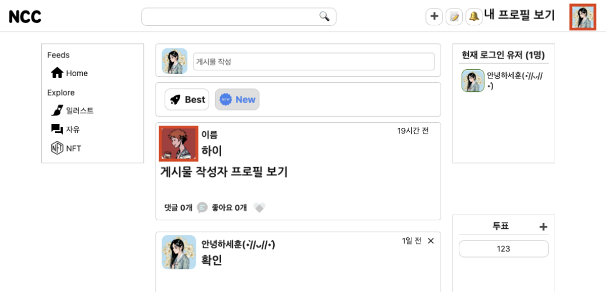
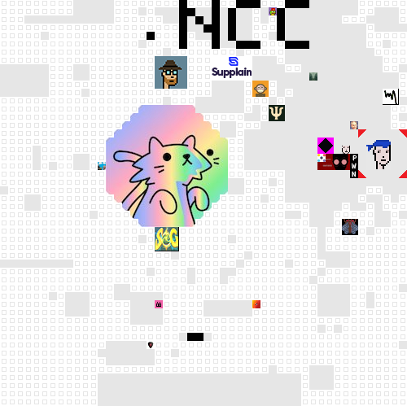
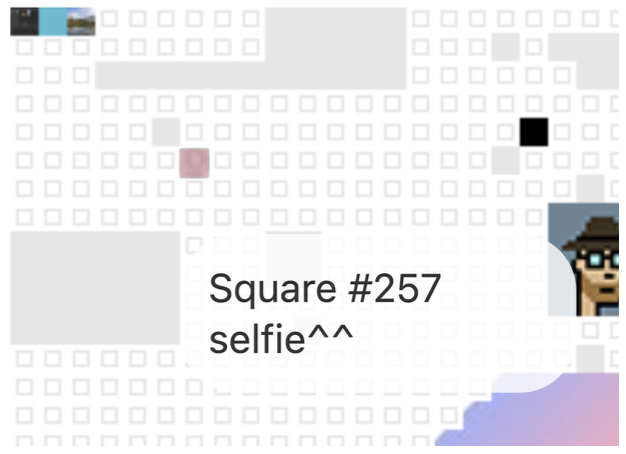

# 🎤 프로젝트 소개
## NFT기반 커뮤니티 서비스 제작

</img>

많은 NFT 프로젝트들이 자신들만의 문화와 세계관을 만들어 사람들에게 소속감을 부여하지만 대부분 디스코드 채널에 참여하여 소통한다. 이러한 그룹 내 소속감과 활동을 더 증진시키 위해 이들만이 사용가능한 커뮤니티를 웹앱을 제작한다.

## 컴포넌트 다이어그램

</img>

## ❗️ 핵심 기능
1. ### NFT를 커뮤니티 사이트의 유저 계정 및 프로필로 활용해  기존 로그인 방식을 대체하고 기본적인 커뮤니티 활동을 가능하게 한다.

</img> 
로그인 화면

 

</img> 
메인 페이지

2. ### NFT를 활용해 웹사이트 광고판을 만들어 자신이 원하는 사이트를 이미지,URL을 설정하여 광고한다.

</img> 

광고판 모습
  
 

  
</img> 
광고판 칸에 대한 정보(이미지,URL,설명으로 구성)

 

## 🛠️ 사용 기술
- React
- NodeJS
- MongoDB
- Solidity
- Ganache & Truffle

